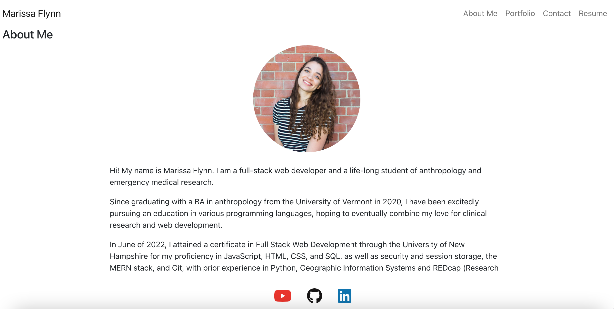
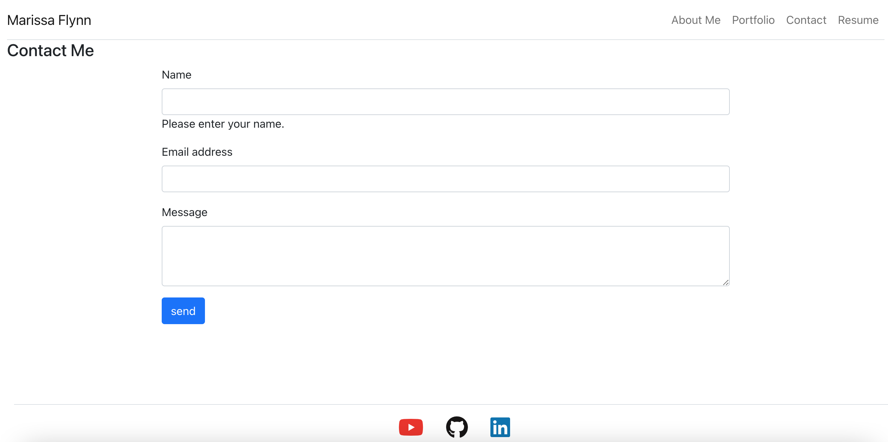

# Personal Portfolio
    

## Description

This project is my personal portfolio that I made using React and React-Bootstrap. In its pages, I have a description about myself, links to my deployed applications and repositories, links to social media, and a page that can be used to contact me.

  ## Table of Contents 
  * [Installation](#installation)
  * [Usage](#usage)
  * [License](#license)
  * [Contributing](#contributing)
  * [Tests](#tests)
  * [Questions](#questions)
  
  ## Installation
  
  To install necessary dependencies, type the following command into the terminal:
  
  > npm init -y

  >npm i

  ## Usage

When the user opens this application, they are able to view a picture of myself with a description of my professional capabilities, view various projects that I have done in several different languages, submit an email to me, or download my resume. The user is able to navigate these pages by clicking on the links in the navigation bar.
  
  > Deployed Application: https://ottercreektourism.github.io/react-portfolio/

 ## Screenshots
 
 
 
  
  ## License

  This portfolio is licensed under the MIT license.  

## Contributing

Contributors are not welcome at this time.

## Tests

To run, type into bash terminal:
> npm start

## Questions

If you have any questions, please visit https://github.com/ottercreektourism or email me at mkflynn13@gmail.com. You can also submit an email through the Contact page of this application.